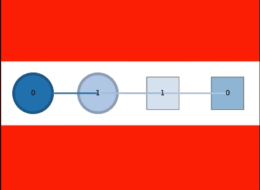

# Lazy CBS: A multi-agent pathfinding solver, using a lazy clause generation backend

## Usage
```
1. Clone the repository along with its submodules.
2. mkdir build && cd build
3. cmake ..
4. make
```

After following the above steps to build the lazycbs module, use `./lazycbs_mapf -i ../example/input.yaml` command inside the build folder to run the solver for given input yaml file.

## The ILLEGAL MOVEMENT BUG

The [original version](https://bitbucket.org/gkgange/lazycbs/commits/7fe04a8b3860dc7d69c25320706040c45d553098) of LazyCBS implementation will allow two adjacent agents swapping locations which is normally considered as illegal movements of other MAPF solvers



The author of LazyCBS fixed this issue by the following two commits: [#1](https://bitbucket.org/gkgange/lazycbs/commits/5096205d72ea22a4c870000ffa5afda1b77883fd) [#2](https://bitbucket.org/gkgange/lazycbs/commits/881340581582e11a63e7dfbf72e9a00a4e859569). You can reproduce the bug by compiling different versions and verify the results by using the map in `./example/unsol_5x3_leg.yaml`.